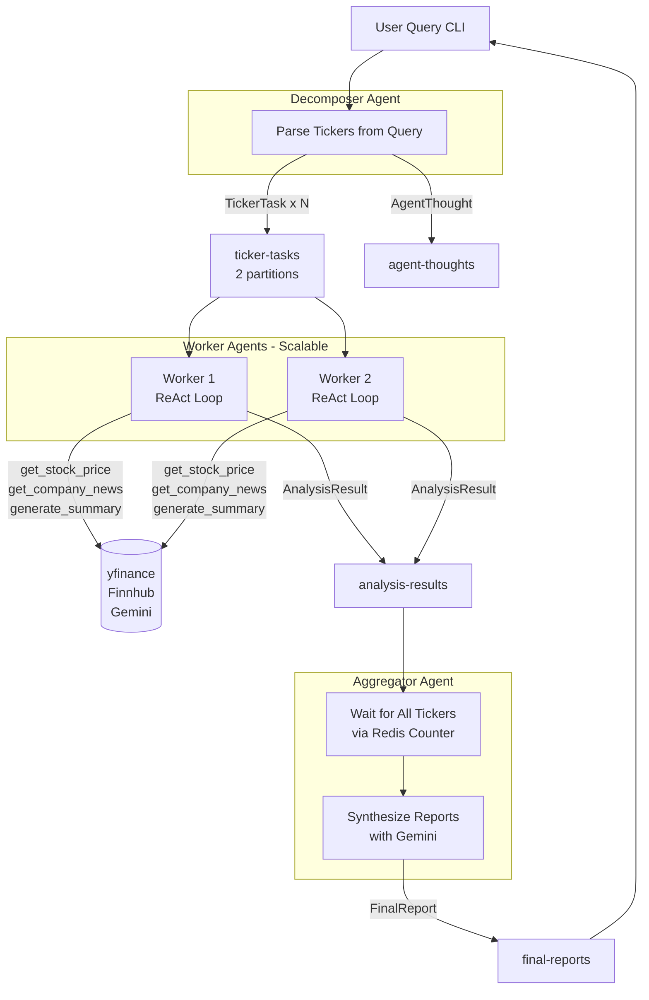

<div align="center" xmlns="http://www.w3.org/1999/html">

# Kafka AI Agent

A multi-agent stock analysis system built on Apache Kafka. Submit a natural language query, and three specialized AI agents collaborate asynchronously to deliver a comprehensive investment report.
</div>

## Architecture



### Message Flow

| Topic | Producer | Consumer | Description |
| :--- | :--- | :--- | :--- |
| `ticker-tasks` | Decomposer | Worker | One message per ticker, 2 partitions for parallel processing |
| `ticker-tasks.DLQ` | Worker | — | Failed tasks after max retries |
| `analysis-results` | Worker | Aggregator | Per-ticker analysis in Markdown |
| `agent-thoughts` | All Agents | — | ReAct loop traces (THOUGHT / ACTION / OBSERVATION) |
| `final-reports` | Aggregator | Decomposer CLI | Final cross-ticker comparison report |

## Project Structure

```
kafka-agent/
├── src/                        # Core source code
│   ├── common/                 # Shared modules used by all agents
│   │   ├── schemas.py          # Pydantic message schemas (TickerTask, AnalysisResult, FinalReport, ...)
│   │   ├── kafka_wrapper.py    # KafkaProducer / KafkaConsumer with Pydantic serialization
│   │   ├── redis_client.py     # Redis helpers for task coordination and distributed locks
│   │   ├── retry.py            # @with_retry decorator with exponential backoff
│   │   └── logging_config.py   # JSON structured logging (stdout + optional file)
│   ├── decomposer/             # Decomposer Agent — parses query and dispatches tasks
│   │   ├── agent.py            # LLM-based ticker extraction logic
│   │   └── main.py             # CLI entry point, waits for FinalReport
│   ├── worker/                 # Worker Agent — analyzes a single ticker
│   │   ├── agent.py            # ReAct loop orchestration
│   │   ├── tools.py            # Tools: get_stock_price, get_company_news, generate_summary
│   │   └── main.py             # Kafka consumer loop
│   └── aggregator/             # Aggregator Agent — synthesizes all results into one report
│       ├── agent.py            # Waits for all tickers, calls Gemini for final report
│       └── main.py             # Kafka consumer loop
├── configs/                    # Configuration constants
│   ├── kafka_config.py         # Topic names and consumer group IDs
│   └── prompts.py              # LLM prompt templates for each agent
├── docker/                     # Dockerfiles for containerized services
│   ├── worker/Dockerfile
│   └── aggregator/Dockerfile
├── scripts/                    # Utility scripts
│   ├── init_topics.py          # Create all Kafka topics (run once after docker compose up)
│   └── benchmark_workers.py    # Measure end-to-end latency across different worker counts
├── tests/
│   ├── unit/                   # Unit tests (no infrastructure required)
│   └── integration/            # Integration tests (requires Kafka + Redis)
├── docker-compose.yml          # Full stack: zookeeper, kafka, kafka-ui, redis, worker, aggregator
├── requirements.txt
└── .env                        # API keys (not committed)
```

- **`src/common/`** — infrastructure wrappers shared by all three agents; change once, applies everywhere
- **`src/decomposer/`** — the entry point of every query; responsible for ticker parsing and result display
- **`src/worker/`** — the scalable unit of work; each instance independently consumes and analyzes one ticker at a time
- **`src/aggregator/`** — the final stage; waits until all sub-tasks complete (via Redis) before calling Gemini for synthesis
- **`configs/`** — centralizes all topic names and prompt templates so agents never hardcode strings
- **`scripts/`** — operational tools for setup and benchmarking; not part of the runtime

## Quick Start

### Prerequisites

- [Docker](https://www.docker.com/) & Docker Compose
- Python 3.11+ (for the CLI)
- [Gemini API Key](https://aistudio.google.com/)
- [Finnhub API Key](https://finnhub.io/)

### Step 1 — Clone and Configure

```bash
git clone https://github.com/your-username/kafka-agent.git
cd kafka-agent
```

Create a `.env` file in the project root with your API keys. See [Configuration](#configuration) for the full list of available variables.

### Step 2 — Set Up Python Environment

```bash
python -m venv .venv

# macOS / Linux
source .venv/bin/activate

# Windows
.venv\Scripts\activate

pip install -r requirements.txt
```

### Step 3 — Start All Services (Docker)

```bash
docker compose up -d --build
```

This starts: `zookeeper`, `kafka`, `kafka-ui`, `redis`, `worker`, `aggregator`.

Wait until all services are healthy:

```bash
docker ps
```

You should see `(healthy)` next to `kafka`, `zookeeper`, and `redis`.

### Step 4 — Initialize Kafka Topics

```bash
python scripts/init_topics.py
```

Expected output:

```
[init] Kafka is ready.
[init] Created: ticker-tasks
[init] Created: ticker-tasks.DLQ
[init] Created: analysis-results
[init] Created: agent-thoughts
[init] Created: final-reports
[init] Done.
```

> If topics already exist from a previous run, the script will skip them safely.

### Step 5 — Start the Interactive CLI

```bash
PYTHONPATH=. python scripts/interactive.py
```

The CLI will start and wait for your input:

```
=== Kafka AI Agent ===
輸入股票查詢（例如：分析 NVDA 和 TSLA），輸入 'exit' 結束。

查詢> 分析 NVDA 和 TSLA

分析中：['NVDA', 'TSLA']，請稍候...

## Stock Comparison Report
...

查詢>
```

After each report is printed, the prompt returns and waits for the next query. Enter `exit` or press `Ctrl+C` to quit.

## Configuration

### Environment Variables

Create a `.env` file in the project root before starting any service:

```bash
# Required
GEMINI_API_KEY=your_gemini_api_key
FINNHUB_API_KEY=your_finnhub_api_key

# Optional (defaults shown)
KAFKA_BOOTSTRAP_SERVERS=localhost:29092
REDIS_URL=redis://localhost:6379/0
LOG_LEVEL=INFO
LOG_FILE=                          # Leave empty to disable file logging
```

| Variable | Required | Default | Description |
| :--- | :--- | :--- | :--- |
| `GEMINI_API_KEY` | ✅ | — | Google Gemini API key for LLM calls |
| `FINNHUB_API_KEY` | ✅ | — | Finnhub API key for company news |
| `KAFKA_BOOTSTRAP_SERVERS` | — | `localhost:29092` | Kafka broker address. Use `kafka:9092` inside Docker |
| `REDIS_URL` | — | `redis://localhost:6379/0` | Redis connection URL |
| `LOG_LEVEL` | — | `INFO` | Logging verbosity (`DEBUG`, `INFO`, `WARNING`, `ERROR`) |
| `LOG_FILE` | — | _(disabled)_ | Write logs to this file path in addition to stdout |

### Docker Services

All services are defined in `docker-compose.yml`. The table below shows what each service does and how to reach it:

| Service | Image | Port | Description |
| :--- | :--- | :--- | :--- |
| `zookeeper` | `cp-zookeeper:7.5.0` | — | Kafka metadata coordination |
| `kafka` | `cp-kafka:7.5.0` | `29092` (host) | Message broker; host access via `localhost:29092` |
| `kafka-ui` | `provectuslabs/kafka-ui` | `8080` | Web UI for inspecting topics and messages |
| `redis` | `redis:7-alpine` | `6379` | Task state coordination between agents |
| `worker` | _(local build)_ | — | Scalable worker agent; consumes `ticker-tasks` |
| `aggregator` | _(local build)_ | — | Aggregator agent; consumes `analysis-results` |

#### Kafka UI

Once the stack is running, open [http://localhost:8080](http://localhost:8080) to inspect topics, browse messages, and monitor consumer group offsets.

### Kafka Topics

Topics are not created automatically — run `scripts/init_topics.py` once after the stack is up (see [Quick Start Step 3](#step-3--initialize-kafka-topics)).

| Topic | Partitions | Retention | Description |
| :--- | :--- | :--- | :--- |
| `ticker-tasks` | 2 | 1h | Worker task queue |
| `ticker-tasks.DLQ` | 1 | 24h | Dead letter queue for failed tasks |
| `analysis-results` | 1 | 1h | Per-ticker analysis results |
| `agent-thoughts` | 1 | 1h | ReAct loop trace messages |
| `final-reports` | 1 | 24h | Final comparison reports |

## Scaling Workers

The Worker service is stateless and can be scaled horizontally. Each instance joins the same consumer group (`workers`) and Kafka distributes `ticker-tasks` partitions across all available instances.

### How to Scale

```bash
# Start with 2 workers
docker compose up -d --scale worker=2

# Scale back to 1
docker compose up -d --scale worker=1
```

> `ticker-tasks` has **2 partitions**, so running more than 2 workers will not increase parallelism — the extra instances will sit idle waiting for a partition assignment.

### Benchmark Results

End-to-end latency measured from task dispatch to `FinalReport` receipt, analyzing **NVDA + TSLA** (2 tickers):

| Workers | Elapsed | Per Ticker | Speedup |
| :--- | :--- | :--- | :--- |
| 1 worker | 45.97s | 22.99s | baseline |
| 2 workers | 31.47s | 15.74s | ~1.46x |

With 1 worker, NVDA and TSLA are analyzed **sequentially**. With 2 workers, each worker picks up one ticker and runs **in parallel**, reducing total elapsed time by ~31%.

> The speedup is less than the theoretical 2x because the Aggregator synthesis step (calling Gemini for the final report) runs after both results arrive and is not parallelized.

## Roadmap

| Status | Item | Description |
| :--- | :--- | :--- |
| 🔲 | **Redis Cache Layer** | Cache stock price (TTL 5min), news (TTL 30min), and summaries (TTL 10min) in `worker/tools.py` to avoid duplicate API and LLM calls for the same ticker |
| 🔲 | **Intent Classification** | Add an intent classifier before the Decomposer to map Chinese company names to tickers (e.g. 台積電 → TSM) and reject non-stock-related queries |
| 🔲 | **Token Optimization** | Change Worker output to a structured JSON summary (price, change, sentiment, key points) instead of full Markdown; Aggregator synthesizes from structured data, significantly reducing input tokens |
| 🔲 | **Deterministic Partition Assignment** | Replace `random` partitioner with explicit `partition=i % num_partitions` to guarantee different tickers are always routed to different partitions for true parallel processing |
